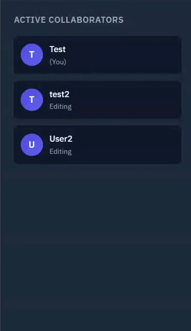
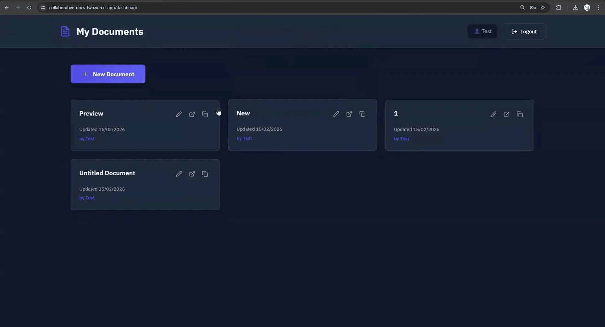
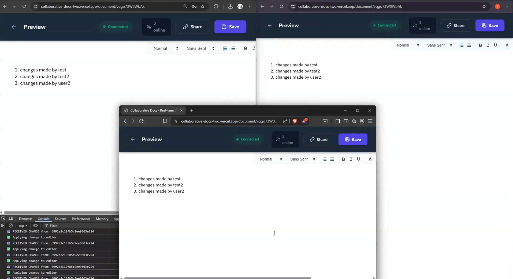
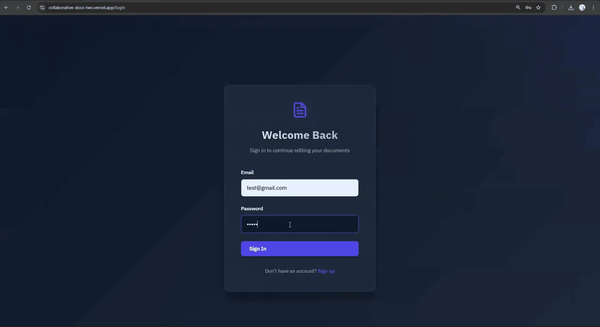

# 📝 Real-Time Collaborative Docs

A modern, real-time collaborative document editor built with React, Node.js, Socket.io, and MongoDB. Edit documents simultaneously with multiple users and see changes instantly.


🚀 Live Demo

Frontend: https://collaborative-docs-two.vercel.app

Backend API: https://collaborative-docs-6yyb.onrender.com

## 🎥 Application Demo

.gif)

## 📸 Screenshots

### 📝 Text Editor


### 👥 Active Collaborators


### 📊 Dashboard


### 🔄 Real-Time Changes


### 🔐 Login Page


## ✨ Features

- **🔄 Real-time Collaboration** - Multiple users can edit documents simultaneously
- **📝 Rich Text Editor** - Full formatting powered by Quill.js
- **🔐 Secure Authentication** - JWT-based auth with bcrypt password hashing
- **🔗 Shareable Links** - Generate unique links for each document
- **👥 Active Users** - See who's currently editing
- **💾 Auto-save** - Changes automatically persist to MongoDB
- **📱 Responsive Design** - Works on desktop and mobile

## 🚀 Quick Start

### Prerequisites
- Node.js 18+
- MongoDB 6+

### Installation
```bash
# Clone repository
git clone git clone https://github.com/Siddx6/Collaborative-Docs.git
cd collaborative-docs

# Backend setup
cd backend
npm install
cp .env.example .env
# Edit .env with your MongoDB URI and JWT secret
npm run dev

# Frontend setup (new terminal)
cd frontend
npm install
npm run dev
```

## 🏗️ Tech Stack

**Frontend:**
- React + TypeScript
- Socket.io Client
- Quill.js (Rich text editor)
- React Router
- Vite

**Backend:**
- Node.js + Express
- TypeScript
- Socket.io (WebSocket)
- MongoDB + Mongoose
- JWT Authentication

## 🎯 Key Features Explained

### Real-time Synchronization
Documents sync instantly across all connected users using WebSocket rooms. Each document has its own room for efficient change propagation.

### Document Management
- Create and rename documents
- Copy shareable links
- Auto-generated unique IDs for each document
- Owner-based access control

### Rich Text Editing
Full-featured editor with formatting, lists, colors, images, and more powered by Quill.js Delta format.

## 📚 API Endpoints

| Method | Endpoint | Description |
|--------|----------|-------------|
| POST | `/api/auth/register` | Register new user |
| POST | `/api/auth/login` | Login user |
| GET | `/api/auth/me` | Get current user |
| POST | `/api/documents` | Create document |
| GET | `/api/documents` | Get user's documents |
| GET | `/api/documents/link/:link` | Get document by link |
| PUT | `/api/documents/:id` | Update document |
| DELETE | `/api/documents/:id` | Delete document |

## 🤝 Contributing

Contributions are welcome! This is a learning/portfolio project, so feel free to fork and experiment.

## 🙏 Acknowledgments

- [Quill.js](https://quilljs.com/) - Rich text editor
- [Socket.io](https://socket.io/) - WebSocket library
- Inspired by Google Docs and Notion

---

⭐ Star this repo if you found it helpful!


